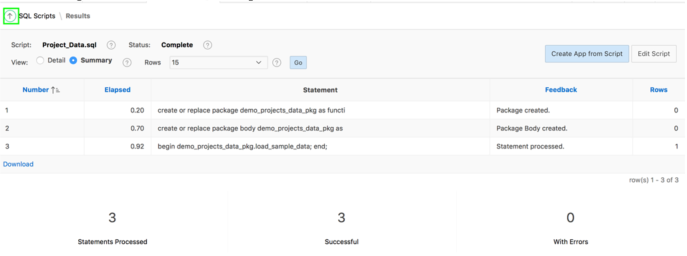

**Oracle Application Express: Developing Database Web Applications**

**Hands-On-Labs Guide**

*Unit 2: Using SQL Workshop*

This exercise includes two hands-on-labs.

**HOL 2-1: Loading the Tables and Data**: In this lab, you use SQL Workshop to create the underlying database objects and data required for you to build the Demo Projects application.
 
**HOL 2-2: Creating a Lookup Table**: In this lab, you create a tabled named HARDWARE and load data in to the table. Then, you create a lookup table.

### HOL 2-1: Loading the Tables and Data

It is essential to have at least the tables defined in order for the Create Application wizard to generate pages in your application. In this hands-on-lab, you create the required database objects, and populate the tables with sample data.

1.	Use SQL Workshop to upload a script that creates the tables for the Demo Projects application. Perform the following steps:

    a)	Click **SQL Workshop** and select **SQL Scripts**.
    

    b)	Click **Upload**.
    c)	Click **Choose File**. 
        Navigate to the working directory where you extracted **apex-course-labs.zip**.
        Locate the **Project_Tables.sql** file, and double-click the file or click the file and then click **Open**.
        Click **Upload**.
    

    d)  Review the uploaded script to see what tables will be created.
        In the SQL Scripts list, click the Edit icon (pencil), to the left of the script you just uploaded. 
    

    e)	Click the **Run** icon to the right of the script you uploaded.
    

    f)	Then, click **Run Now**.
    

    g)	Scroll down to view the results of the script that you just ran. 
    

2.	Currently the tables you created do not have any data. A script has been provided that creates an Oracle database package which can be run at any time to insert or reset the data in the tables. Use SQL Workshop to upload a script that you can use to populate table data. Perform the following steps: 
    a)	Click SQL Scripts. Click Upload. 
    b)	Click Choose File, where you extracted **apex-course-labs.zip**. 
    c)	Locate the **Project_Data.sql** file, and double-click the file or click the file and then click Open.
    Click **Upload**.
    

    d)	Click the **Run** icon to the right of the script you uploaded (top row).     
    
    e)	Then, click **Run Now**.
    f)	Scroll down, to view the results.
    

3. In step 2, you uploaded a package called DEMO_PROJECTS_DATA_PKG. However, this package has not yet been run so the tables you created still do not have any data. The SQL Commands facility, within SQL Workshop, allows a developer to run any valid SQL commands. You will run a SQL command to execute the data package and populate the tables. Use SQL Commands to execute n Oracle Database package. Perform the following steps:

    a) Click the Up arrow, before SQL Scripts. 
    

    b) Click **SQL Commands**. 
    

    c) Enter the following code:
    ```
    begin
    demo_projects_data_pkg.load_sample_data; 
    end;
    ```
    d) Click **Run**.
    

4. Use the Object Browser within SQL Workshop to review all of the database objects, such as the tables and packages you created, available in the underlying Oracle database schema which is associated with the Application Express workspace you logged into. Perform the following steps: 
    a) At the top of the page, select **SQL Workshop** and then select **Object Browser**.
    b) In Object Browser, select the **DEMO_PROJ_TEAM_MEMBERS** table, and then click on the **Data** tab. 
    
    **Note**: There are a number of other tables listed, outside of those you created using the script file above. The APEX$ tables are created by Application Express to store internal data specific to your workspace. Tables such as DEMO_CUSTOMERS were created when the Sample Database Application was installed. The Sample Database Application is installed by default when an Application Express Workspace is created. 

    c) To review the package you created, select **Packages**. 
    
    d) Then, select **DEMO_PROJECTS_DATA_PKG**.
    - Click **Body** to review the primary PL/SQL rather than the specification. 
    
    **Note**: This package includes complex PL/SQL code to insert images and replicate users
    entering in records. It is not important that you understand the PL/SQL code in this
    package, as you will not normally have to populate data in this matter. Generally, you 
    would create the tables with no data and then use the application you build to insert the
    records. 

### HOL 2-2: Creating a Lookup Table

In this hands-on-lab, you use the Data Workshop utility to create a table and populate the table with data. Once this table is created, you also create a lookup table.

1. Click **SQL Workshop > Utilities > Data Workshop**.
    

2.	Click **Load Data**.
    
3. The Load Data Wizard appears. 
   Navigate to the working directory where you have **apex-course-labs.zip**.
4. Locate the **hardware.csv** file, and then drag and drop the file to the **Load Data** dialog.    Alternatively, in the Load Data dialog, click **Choose File**, and then double-click the          **hardware.csv file**.
   Click **Next**.
    

5. Enter **Hardware** for Table Name, and press tab.
   Notice that the Error Table Name is populated. 
    

6. Accept the remaining defaults, and click **Load Data**.
    

7. The new table is now created and is populated with the data. Click **View Table**.
    

8. In the Object Selection pane, click **Hardware**. 
   The Detail pane now shows details about Hardware table. For the Hardware table, review the column names and data types.
   Click **Data**. 
    
    Now you see a report of the data conatained in the Hardware table.   

9. You want to create a lookup table now. Perform the following steps:
    a) Click **Table**. Click **Create Lookup Table**.
    
    
    b)	Select **DEPARTMENT** for Column. Click **Next**.
    

    c) Accept the defaults on this page and click **Next**.
    

    d) Click Create **Lookup Table**.
    

    e) Review the table definition of **DEPARTMENT_LOOKUP** table.
    

    f) In the Object Selection pane, click **HARDWARE**. 
    Review the table details. Notice that the DEPARTMENT column has been extracted from the HARDWARE table and is now available in the DEPARTMENT_LOOKUP table.
    
    
